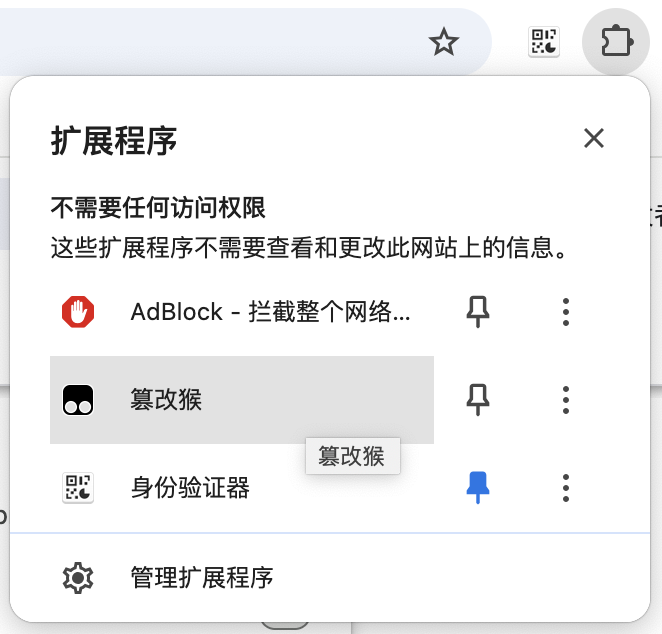

# 少前2bbs自动兑换物品脚本

由于觉得少前2论坛的兑换物品功能比较繁琐，于是萌生了写个脚本以代替手工操作的想法，也就是本脚本的由来。

原本只是想兑换体力，但后面发现完成每日任务所获取的积分足以换取所有物品之后，索性把其他物品也加上了，蚊子腿再小也是肉.jpg（笑）。

该脚本基于论坛的api进行开发，但已经将执行流程调整至比较接近人类的行为，所以理论上不会对服务器的正常运行造成影响。

在安装了脚本，并为之配置环境后，打开论坛时，脚本会自动执行，频率为每日一次（指的是主要逻辑），**共分为两个阶段**：

**1、执行中**

该阶段会执行以下事件：

- 签到
- 论坛每日(点赞、浏览、分享)
- 兑换物品

默认情况下，此时论坛右上角会显示“执行中”的字样，表示程序正在运行，此过程会持续数秒。


*图1 脚本执行中通知*

**2、执行完成**

在相同的位置，出现“执行完成”字样的通知，表示程序执行完成，并将结果缓存于浏览器，直至下一天。


*图2 脚本执行完成后通知*

随后在游戏内领取物件。


*图3 兑换成功-1*


*图4 兑换成功-2*

## 一、在使用脚本之前(重要)...

有一点要提前告知的事项。

该脚本的可协同一个额外的配置文件运行：**该配置具有包括论坛账号&密码在内的数据(请放心，仅限于本地读取)**，因此需要做些许改动，若能提供的话，请按照后续章节进行操作；若不想或懒得提供的话，后面就不用看了，直接安装使用即可。但作为代替的是，当凭证过期时，由于没有账号信息，本程序无法自动完成登录，需要自己手动进行。

## 二、配置脚本运行环境

本章节虽然需要手动操作，但并不难。**可以简单概括为两步：1）新建配置文件；2）将文件的路径同步至脚本中**。

### 1、创建配置文件

在本地创建一个文件，可命名为config.json（或其他别的名字，只需要保证路径正确），其格式如下：

```json
{
    "account": "你的账号",
    "password": "你的密码",
    "exchanging": "1,2,3,4,5",
    "notification": 1
}
```

将以上文本复制粘贴到新文件中，除了需要输入自己的账号&密码外，其他配置属性均可采用默认值，完成后保存文件。

> 另外，配置项exchanging表示兑换物品的id（1->情报拼图，2->萨狄斯金，3->战场报告，4->解析图纸，5->基原信息核，在完成论坛每日任务的情况下，全部兑换是没有问题的）；notification表示是否开启通知（为0时表示关闭）。

### 2、对脚本源码做些许改动

这一步主要是将上述的配置文件应用于脚本。

> 下面以chrome为例，如果没安装油猴插件的话，请自行安装，无论是百度，还是谷歌，或别的什么都行，都能搜出一大堆教程。

#### 2.1 在右上角点击“拓展程序”，找到“篡改猴”，并点击



*图1 点击“篡改猴”*


*图2 点击“管理面板”*

#### 2.2 找到本脚本，点击编辑


*图3 编辑脚本*

#### 2.3 修改配置文件路径

在源码头部找到如下位置：

```text
// ==UserScript==
略...
// @grant        GM_getResourceText
// @resource     config http://your/path/to/config.json
// @license      MIT
// ==/UserScript==
```

将@resource项"config"字样后，以"http"开头的路径修改为你的路径（路径最好不包含中文，否则可能会有问题）。

且配置文件路径应该以文件协议开头，如现有路径“file:///D:/xxx/MyApp.localized/gf2-bbs-claimer/config.json”时，则应该修改为：


```text
// ==UserScript==
略...
// @grant        GM_getResourceText
// @resource     config file:///D:/xxx/MyApp.localized/gf2-bbs-claimer/config.json
// @license      MIT
// ==/UserScript==
```

这里有个比较简单的做法：将已创建好的配置文件拖至浏览器打开后，将搜索栏的路径复制粘贴到此处即可。

最后别忘了保存。

### 3、授权油猴插件读取文件权限

> 如果已经授权过，该步骤可忽略

出于安全问题，默认情况下，油猴插件没有读取本地文件的权限，需要手动赋予。

#### 3.1 在浏览器输入：chrome://extensions/


*图4 打开拓展程序管理面板*

#### 3.2 找到油猴插件，并点击“详情”


*图5 油猴插件*

#### 3.3 点击启用权限

> 未启用时为灰色


*图6 允许油猴插件访问文件网址*

***

至此，前置工作已经全部完成💊，脚本应该可以正常运行了🎉🎉。

如果觉得还不错的话，可以分享给需要的人，或者有什么问题和建议时，尽管呼我。